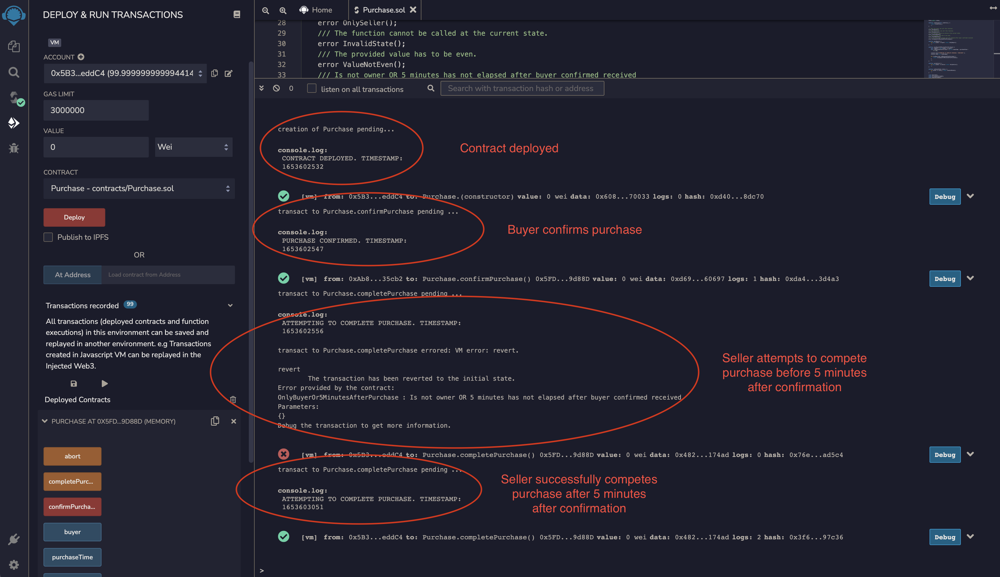
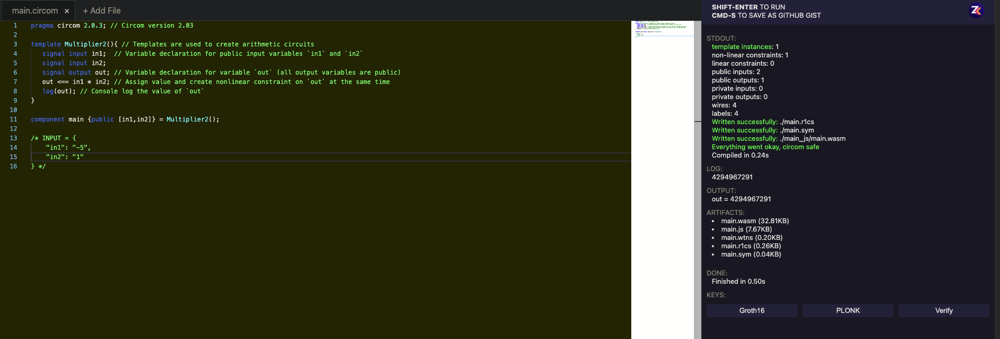
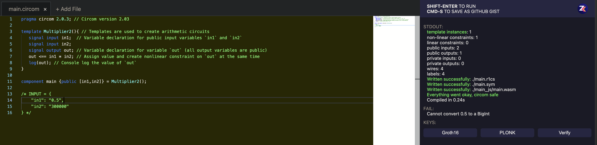

# zku-application

#Question 6 screenshot of timestamps:

#Question 8 screenshot of outputs:

Positive integer inputs. Result correct

Negative integer inputs. Result underflow

Float inputs. Float not accepted, error thrown

